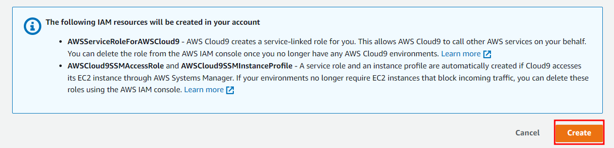

### 1.	Cloud9 서비스
상단의 검색창에 Cloud9 검색 후 Cloud9 서비스 클릭


### 2.	Cloud9 환경 생성
-	Name : k8s-ide
-	Environment type : New EC2 instance
-	Platform : Ubuntu 18.04


 


입력 및 선택 완료 후 Create 클릭



### 3.	Cloud9 IDE OPEN 

Open 클릭


### 4.	Cloud9 환경 생성 완료


### 5.	Key 업로드

Cloud9 좌측 상단 File 클릭, Upload local Files 클릭


### 6.	이전에 다운로드 받은 k8s-key.pem 파일을 드래그 앤 드랍
 


### 7.	이전에 배포한 EC2 인스턴스 들의 IP확인

EC2 서비스 – 인스턴스로 이동 후 K8S 로 태깅된 인스턴스 3개의 프라이빗 IP 주소 확인

 

### 8.	Cloud9 에서 아래 명령어를 사용하여 key 파일 권한 변경

```
chmod 600 k8s-key.pem
```

### 9.	인스턴스로 접속
```
ssh -i k8s-key.pem <위에서 확인한 IP 1개>
```

yes입력


인스턴스 접속화면

 
	
### 10.	호스트네임 변경
 
```
sudo hostnamectl set-hostname k8s-master
sudo -i
```


### 11.	새로운 터미널 오픈

플러스 (+) 버튼 클릭 후 New Terminal 클릭 또는 단축키 Alt+T 키 입력

 

### 12.	7번 과정 에서 확인한 다른 2개의 인스턴스로도 접속 및 호스트 네임 변경 (9~10과정반복)

-	나머지 인스턴스 호스트네임 : 
-	k8s-worker1
-	k8s-worker2
 


### 13.	Cloud9 터미널 탭 3개(각 노드접속) 확인
