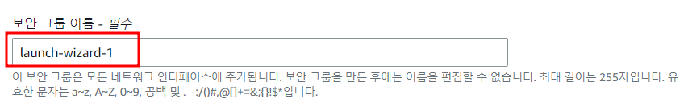
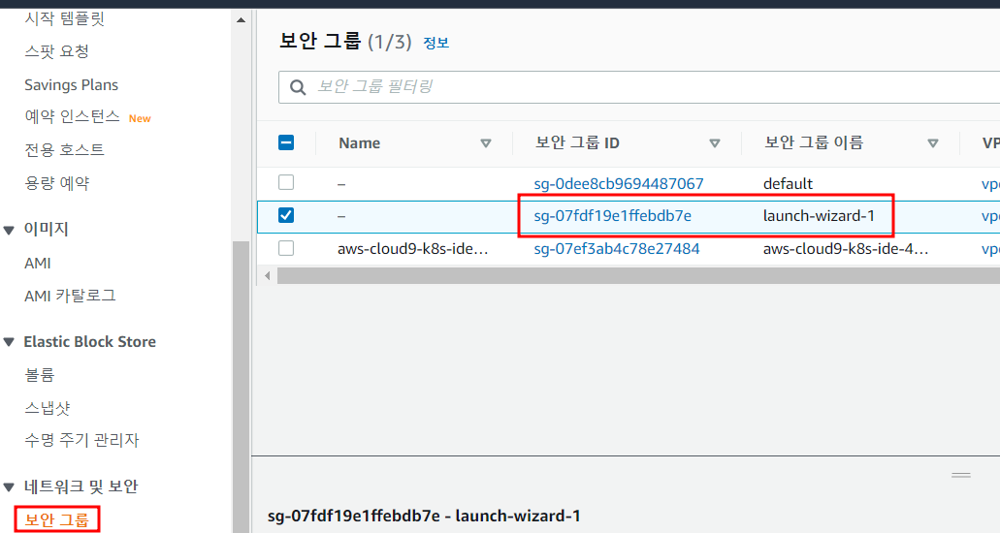

# Task 1 - EC2 배포

#### 1. aws 로그인

전달 받은계정으로 로그인

#### 2. 리전 선택

우측 상단 리전을 서울로 선택

#### 3. EC2 서비스로 이동

상단의 검색창에 EC2 검색 후 EC2 서비스 클릭

#### 4. 인스턴스 생성

좌측 메뉴 중 인스턴스 클릭 후 우측 상단 인스턴스 시작 클릭

#### 5. 인스턴스 Tag, AMI, TYPE 설정

* 이름 : K8S<mark style="color:red;">**-## (##은 user 번호 입력)**</mark>
* 애플리케이션 및 OS 이미지 : Ubuntu
* AMI : Ubuntu 18.04 LTS
* 인스턴스 유형 : t3.small

각 항목 선택 및 입력

#### 6. 키페어 생성

새 키 페어 생성 클릭

* 키 페어 이름 : k8s-key-<mark style="color:red;">**## (##은 user 번호 입력)**</mark>

입력 후 키 페어 생성 클릭

#### 7. 다운로드 되는 k8s-key.pem 파일을 잘 보관

#### 8. 네트워크 설정

우측 편집 클릭 후 하단의 보안 그룹 규칙 추가 클릭

* 유형 : 사용자 지정 TCP
* 소스 유형 : 사용자 지정
* 원본 : 0.0.0.0/0
* 포트 범위 : 30000-32767

> 구성 전 보안 그룹 이름 확인
>
> launch-wizard-<mark style="color:red;">**## (##은 user 번호 입력)**</mark>

아래와 같이 선택 및 입력

#### 9. 스토리지 구성 및 인스턴스 개수 설정

* 스토리지 구성 : 20 G 설정
* 인스턴스 개수 : 3

입력 후 하단 인스턴스 시작 클릭

#### 10. 인스턴스 배포가 완료되면, EC2 – 보안그룹으로 이동 후 8 과정에서 확인한 보안그룹의 이름을 찾아 보안그룹 ID값을 클릭

#### 11. 우측 하단의 인바운드 규칙 편집 클릭, 규칙 추가 클릭

 

#### 12. 아래와 같이 설정 후 규칙 저장 클릭

* 유형 : 모든 트래픽
* 소스 : 8과정에서 확인한 보안그룹 이름

