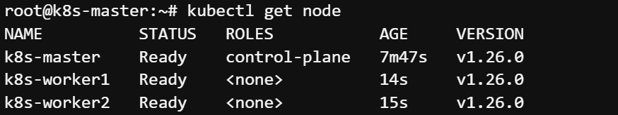

# Task 4 - 클러스터 초기화 및 Master-Worker 조인

> 주의사항

> 1\~4 과정은 Master 만 진행합니다.

#### 1. 클러스터 초기화 (2\~5분 소요)

```
kubeadm init \
--pod-network-cidr=172.16.0.0/16 \
--apiserver-advertise-address=<Master IP>
```

종료 되면 마지막 출력 라인에 kubeadm join 으로 시작하는 명령어를 잘 저장.

#### 2. kubectl 설정

```
mkdir -p $HOME/.kube
sudo cp -i /etc/kubernetes/admin.conf $HOME/.kube/config
sudo chown $(id -u):$(id -g) $HOME/.kube/config
export KUBECONFIG=/etc/kubernetes/admin.conf
```

#### 3. Calico 네트워크 플러그인 설치

```
kubectl apply -f https://docs.projectcalico.org/manifests/calico.yaml
```

#### 4. kubectl 자동완성 적용

```
source <(kubectl completion bash)
echo "source <(kubectl completion bash)" >> ~/.bashrc
source /etc/bash_completion
alias k=kubectl
complete -F __start_kubectl k
```

> 주의사항

> 5 과정은 Worker1, 2 만 진행합니다.

#### 5. 각 Worker 에서 클러스터로 조인

```
kubeadm join ~~~~ (1번 과정에서 저장한 명령어)
```

#### 6. Master 에서 조인 결과 확인

```
kubectl get nodes
```



k8s 클러스터 배포 및 Worker와 연동 완료
